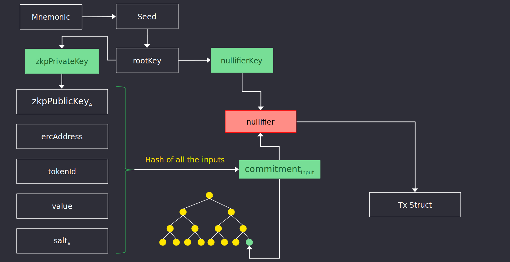

Circuits are used to define the rules that a transaction must follow to be considered correct. There are broadly three types of circuits, one for each type of transaction:

- [Deposit](#deposit)
- [Transfer](#transfer)
- [Withdraw](#withdraw)

Every transaction includes a ZK Proof following the constraints specified in these circuits. Users construct this proof using a Wallet,
or through a Client server.
A proof is generated only if all the following cases are true:

- New [commitment](./commitments#what-are-commitments) is valid
- Old [commitment](./commitments#what-are-commitments) is valid and owned by the sender
- Nullifier is valid
- Merkle Tree path/root is valid
- Ciphertext containing commitment is valid

## Deposit
Deposits convert publicly visible ERC tokens into a token commitment that holds the same value or token id as that of the original token,
and the Nightfall public key of the intended commitment owner. 

A Deposit ZK Proof proves that the prover has created a valid commitment $Z_A$ with a public key $pk_A$. 
- As public inputs it contains the commitment $Z_A$, the value/tokenId ɑ and the ERC token Address @.
- As secret inputs it contains the public key $pk_A$ and salt σ

The circuit then checks that $Z_A$ == H(@ | ɑ | $pk_A$ | σ)
Leaked information of a deposit transaction include the address that minted the new commitment and the address and value of the ERC token being used.

## Transfer
Transfers enable the transmission of up two token commitments of the same asset between two parties by nullifying the previous commitment and creating two new commitments:
- One will be sent to the receiver, containing the value of the transferred ammount
- Another will be created with the value of the change (difference between sum of values of commitments used minus value transferred) and owned by the transmitter.

A Transfer ZK Proof proves that the prover has nullified one or two old commitments which existed in the Merkle Tree, created one or two new commitments, and encrypted its information for the recipient. As public inputs it uses the new commitment(s) $Z_B$, the ERC token Address @, the Merkle Tree root MTR, the new nullifier(s) ν and a ciphertext with the commitment(s) information.

As private data it uses the sender secret key `$nsk_A$`, recipient public key `$pk_B$`, value/id of token ɑ, salt `$\sigma_B$`, old commitment(s) `$Z_A$`,
path of commitment in Merkle Tree and plaintext such that:

- $Z_B$ = H(@ | ɑ | $pk_B$  | $\sigma_B$)
- $Z_A$ = H(@ | ɑ | H($nsk_A$) | $\sigma_A$ )
- ν = H($nsk_A$ | $Z_A$)
- MTR = pathCalculation( $Z_A$ | MT Path)
- Ciphertext = encrypt(plaintext, $pk_B$), where plaintext includes @, ɑ and $\sigma_A$

In either case, the information leaked will be that an Ethereum address has nullified one (Single Transfer) or two (Double Transfers) commitments
amongst the commitment pool owned by the transmitter, and that one (Single Transfer) or two (Double Transfers) new commitments have been created.
Information on the new owner, which commitments were spent or the amount transferred remains private.

## Withdraw
Withdraw is the operation of nullifying an existing Nightfall commitment and converting it into publicly visible ERC tokens with the same value and token Id as the burnt commitment. Withdraw is the opposite operation to Deposit. Similarly to transferes, withdrawals accept as input up to two commitments.

A Withdraw ZK Proof proves that the prover has nullified an old commitment which existed in the MerkleTree. As public data the prover uses value/token id `ɑ`, ERC token address `@`, Merkle Tree root `MTR` and nullifier `ν`.
As private inputs, prover uses sender secret key `$nsk_A$`, salt `σ`, old commitment `$Z_A$` and Merkle Tree path such that:

- $Z_A$ = H(@ | ɑ | H(nskA) | σ )
- ν = H($nsk_A$ | $Z_A$)
- MTR = pathCalculation( $Z_A$ | MT Path)

Information leaked during a withdrawal includes the address of the address that withdrew the commitment and the value/token Id and address of the token withdrawn.

### Cooling off period

Withdrawals require a `COOLING OFF` period of one week to finalize. This is due to the optimistic nature of Nightfall, since a new block is assumed to be correct until some challenger submits a fraud proof. The funds are held until a reasonable period of time (one week) has passed and they can be withdrawn to L1. Nightfall plans to accept a new actor called Liquidity Provider which would be able to run its own challenger and advance the withdrawal for the user in exchange for a fee.

