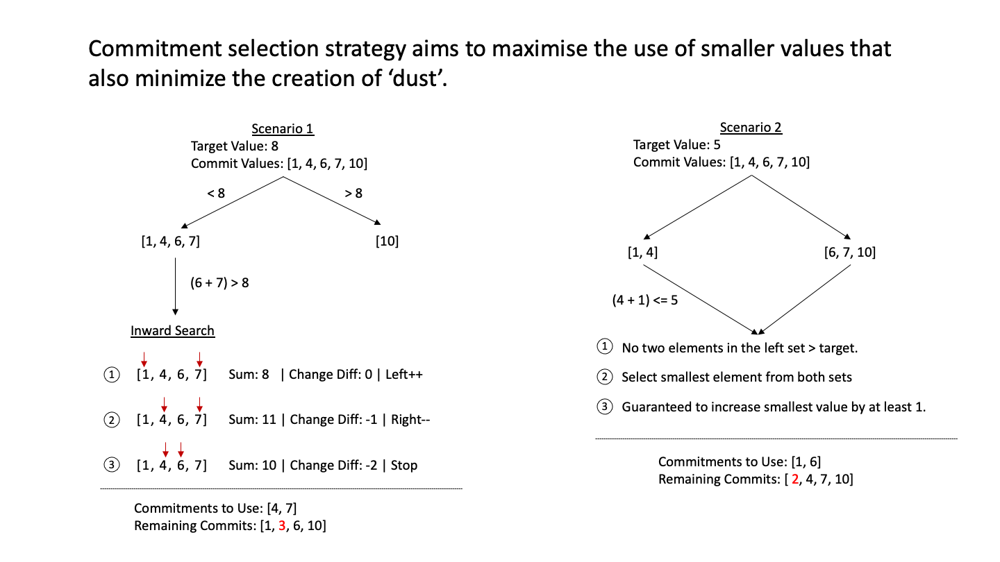

Current ZKP transfer circuits used in Nightfall are restricted to 2 input - 2 output and 1 input - 1 output transfers, with all inputs and outputs having a value > 0. If a transactor's set of commitments contain primarily low value commitments (dust), they may find it hard to conduct future transfers.

Observe the following value sets

- Set A: [1, 1, 1, 1, 1, 1]
- Set B: [2, 2, 2]
- Set C: [2, 4]

While all three sets have equivalent total sums, the maximum value transfer that can be transacted by sets A, B, and C are 1, 3, and 5 respectively. This is one of the reasons why large commitments values are preferred. The commitment selection strategy used mitigates this risk by prioritising the use of small value commitments while also minimising the creation of dust commitments.

## Single Transfer
In the base case, whereby a transactor's set contains a commitment of exact value to the target value, it will be used for the transfer.

## Double Transfer
If a single transfer is not possible, a double transfer will be attempted.

1. Sort all commitments by value.
2. Split commitments into two sets based on whether their values are less than (`LT`) or greater than (`GT`) the target value.
3. If the sum of the two largest values in set `LT` is LESS than the target value:
    - We cannot arrive at the target value with two elements in this set.
    - Our two selected commitments will be the smallest commitment in `LT` and the smallest commitment in `GT`.
    - It is guaranteed that the output (change) commitments will be larger than the input commitment from `LT`.
4. If the sum of the two largest values in set `LT` is GREATER than the target value:
    - We use a standard inward search whereby we begin with two pointers, `lhs` and `rhs` at the start and end of the `LT`.
    - We also track the change difference, this is the change in size of the smallest commitment in this set resulting from this transaction's output.
    - If the sum of the commitments at the pointers is greater than the target value, we move pointer `rhs` to the left.
    - Otherwise, we move pointer `lhs` to the right.
    - The selected commitments are the pair that minimise the change difference. The best case in this scenario is a change difference of -1.

The following picture depicts the commitment selection mechanism. 
